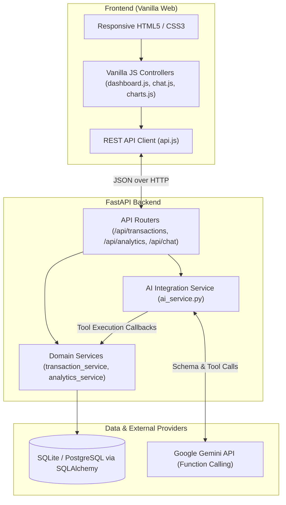
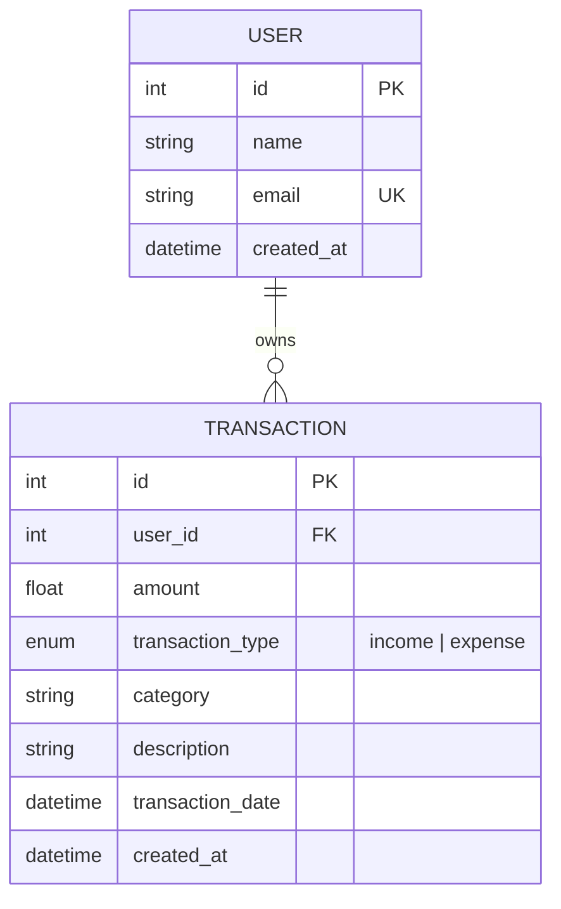

# FinMate — AI Personal Finance Assistant

> **2026 Shenzhen Fintechathon – Track 1 Prototype**  
> An intelligent, conversational personal finance management platform designed to help users track transactions, understand cash flows, analyze spending habits, and make informed financial decisions.

---

## 1. Overview

**FinMate** is an AI-powered personal finance web application that bridges conversational intelligence with deterministic financial record-keeping. Through an intuitive natural language chat interface and an interactive fintech dashboard, users can record incomes and expenses, query historical trends, analyze spending breakdowns, detect anomalous expenditures, and receive contextual budgeting guidance.

Crucially, **FinMate enforces financial accuracy**: the AI does not hallucinate numbers or speculate on financial states. Instead, it interacts directly with verified database records through a strict tool/function-calling architecture, ensuring 100% data integrity and auditability.

---

## 2. Features

- **Conversational Transaction Extraction**:
  - Automatically parse natural language inputs (e.g., *"I spent 50 yuan on lunch"*, *"Earned 2000 from freelance"*) into structured financial transactions with category, amount, type, and timestamp.
  - Asks for clarification if details are ambiguous or missing (e.g., *"What category should I use for this 200 yuan expense?"*).
- **Verified Financial Q&A**:
  - Ask questions like *"How much did I spend this month?"*, *"What category do I spend the most money on?"*, *"Show me my expenses for the last 7 days"*, or *"How much money did I save this month?"*.
  - Calculations are executed natively by database services, never hallucinated by the LLM.
- **Fintech Dashboard**:
  - Real-time summary cards: **Total Balance**, **Total Income**, **Total Expenses**, and **Net Savings**.
  - Interactive Chart.js visualizations:
    1. **Expense by Category** (Doughnut chart with percentage breakdowns).
    2. **Income vs. Expense** (Bar chart with monthly trends).
    3. **Spending Over Time** (Line chart tracking 30-day expenditure pace).
  - Live recent transaction list with category badges, color-coded positive/negative indicators, and instant CRUD capabilities.
- **Comprehensive Transaction Management**:
  - Filterable by Category and Transaction Type (`income` vs `expense`).
  - Pagination support for scalable record management.
  - Add, edit, and delete transactions with immediate modal feedback.
- **Advanced Financial Analytics**:
  - Automated anomaly detection flagging categories with >50% spending spikes compared to the previous month.
  - Calculation of monthly averages, burn rate, and top expense drivers.
- **Budgeting Assistance**:
  - Pragmatic budgeting recommendations grounded in actual historical expense distribution.
  - Strictly operates as an educational finance assistant, avoiding speculative or high-risk investment schemes.

---

## 3. Architecture

FinMate implements a clean, layered separation of concerns between presentation, orchestration, domain logic, persistence, and external AI services.



### Data & AI Flow

1. **User Query**: The user types a query into the chat interface (e.g., *"How much did I spend on food this month?"*).
2. **Intent & Tool Selection**: FastAPI passes the message along with registered tool declarations to Google Gemini (`gemini-2.0-flash`).
3. **Deterministic Query**: Rather than answering with a fabricated estimate, Gemini returns a tool call request (`get_spending_for_category(category="Food", period="this_month")`).
4. **Service Execution**: The backend invokes `transaction_service.py` to run exact SQLAlchemy aggregations against SQLite.
5. **Tool Response Synthesis**: The real structured data is supplied back to Gemini, which generates a natural-language, conversational explanation.
6. **Action Notification**: If an action took place (e.g. `add_transaction`), the frontend receives an `action_taken` event and automatically re-renders the dashboard and charts.

---

## 4. Technology Stack

| Layer | Technology | Details |
|---|---|---|
| **Frontend** | HTML5, CSS3, Vanilla JS | Lightweight, zero-build-step architecture with custom CSS design tokens, dark fintech aesthetic, and smooth micro-animations. |
| **Data Visualization** | Chart.js 4.4 | Doughnut, grouped bar, and line charts dynamically updated on state changes. |
| **Backend Framework**| Python 3.11+, FastAPI | High-performance asynchronous API framework with automatic OpenAPI documentation. |
| **Validation** | Pydantic v2 | Strict schema typing and validation for API requests, query parameters, and responses. |
| **ORM & Database** | SQLAlchemy 2.0, SQLite | Relational database ORM structured with clean abstraction, allowing instant swap to PostgreSQL. |
| **AI & LLM** | Google Gemini API (`gemini-2.0-flash`) | Isolated AI service with JSON schema tool definitions for deterministic function calling. |
| **Testing** | pytest, FastAPI TestClient | Comprehensive test suite covering endpoints, schema constraints, calculation logic, and error states. |
| **Server** | Uvicorn | Lightning-fast ASGI production web server. |

---

## 5. Project Structure

```text
finmate/
│
├── backend/
│   ├── app/
│   │   ├── __init__.py
│   │   ├── main.py                  # FastAPI application entry point & static file mount
│   │   │
│   │   ├── api/                     # REST API route controllers
│   │   │   ├── __init__.py
│   │   │   ├── chat.py              # POST /api/chat
│   │   │   ├── transactions.py      # CRUD /api/transactions
│   │   │   ├── analytics.py         # /api/analytics/summary, /categories, /trend, /alerts
│   │   │   └── users.py             # User profile endpoints
│   │   │
│   │   ├── core/                    # Core configs & security
│   │   │   ├── __init__.py
│   │   │   ├── config.py            # Pydantic Settings & environment variables
│   │   │   └── security.py          # Security utilities & auth placeholders
│   │   │
│   │   ├── db/                      # Database configuration & models
│   │   │   ├── __init__.py
│   │   │   ├── database.py          # SQLAlchemy engine, session factory, Base
│   │   │   └── models.py            # User and Transaction ORM models
│   │   │
│   │   ├── schemas/                 # Pydantic request/response schemas
│   │   │   ├── __init__.py
│   │   │   ├── transaction.py
│   │   │   ├── chat.py
│   │   │   └── analytics.py
│   │   │
│   │   ├── services/                # Business logic & integrations
│   │   │   ├── __init__.py
│   │   │   ├── ai_service.py        # Gemini tool-calling engine & system prompts
│   │   │   ├── transaction_service.py # Transaction calculations & queries
│   │   │   └── analytics_service.py # Aggregations, trend analysis, & anomaly alerts
│   │   │
│   │   └── utils/
│   │       ├── __init__.py
│   │       └── helpers.py           # Realistic 30+ item demo data seeder & formatting
│   │
│   ├── tests/                       # Automated test suite
│   │   ├── __init__.py
│   │   ├── conftest.py              # In-memory SQLite fixtures & TestClient
│   │   ├── test_transactions.py     # CRUD & balance calculation tests
│   │   ├── test_analytics.py        # Analytics & alerts tests
│   │   └── test_chat.py             # Chat endpoint & input validation tests
│   │
│   ├── Dockerfile                   # Container build recipe
│   ├── requirements.txt             # Python dependencies
│   └── .env.example                 # Template for environment configuration
│
├── frontend/
│   ├── index.html                   # Single-page application UI with Sidebar & Dashboard
│   ├── dashboard.html               # Seamless redirect entrypoint
│   │
│   ├── css/
│   │   ├── style.css                # Fintech dark theme design system & layout
│   │   └── dashboard.css            # Component-specific rules
│   │
│   ├── js/
│   │   ├── api.js                   # Centralized REST API client
│   │   ├── chat.js                  # Chatbot UI, suggested prompts & markdown parser
│   │   ├── dashboard.js             # Navigation, CRUD modals, pagination & filters
│   │   └── charts.js                # Chart.js renderers & theme palettes
│   │
│   └── assets/
│       └── logo.svg                 # FinMate branding icon
│
├── data/
│   ├── .gitkeep
│   └── finmate.db                   # SQLite database (auto-generated on startup)
│
├── .gitignore
├── README.md
└── docker-compose.yml               # Multi-container deployment configuration
```

---

## 6. Database Schema

FinMate models entities using SQLAlchemy ORM with clear foreign key relationships and indexation on frequently queried columns:



- **Supported Default Categories**: `Food`, `Transportation`, `Shopping`, `Entertainment`, `Bills`, `Healthcare`, `Education`, `Salary`, `Freelance`, `Investment`, `Gift`, `Housing`, `Other`.
- **Extensibility**: Categories are represented as dynamic strings with standard defaults, making it easy to introduce custom user categories without database migration bottlenecks.

---

## 7. API Endpoints

All API endpoints return JSON and use standard HTTP status codes. Automatic Swagger/OpenAPI documentation is available at `/docs`.

### Chat
| Method | Endpoint | Description |
|---|---|---|
| `POST` | `/api/chat` | Send conversational query to AI; returns natural language reply and action payload. |

### Transactions
| Method | Endpoint | Description |
|---|---|---|
| `POST` | `/api/transactions` | Create a new transaction (`amount`, `transaction_type`, `category`, `description`, `transaction_date`). |
| `GET` | `/api/transactions` | Get paginated list of transactions with optional filtering by `category`, `transaction_type`, and dates. |
| `GET` | `/api/transactions/{id}`| Retrieve a single transaction by ID. |
| `PUT` | `/api/transactions/{id}`| Update fields of an existing transaction. |
| `DELETE`| `/api/transactions/{id}`| Delete a transaction record (returns 204 No Content). |

### Analytics
| Method | Endpoint | Description |
|---|---|---|
| `GET` | `/api/analytics/summary` | Retrieve total balance, total income, total expenses, transaction count, and monthly trends. |
| `GET` | `/api/analytics/categories` | Retrieve category breakdown with aggregate amounts and percentages. |
| `GET` | `/api/analytics/monthly` | Retrieve monthly income, expense, and net savings for the past N months. |
| `GET` | `/api/analytics/trend` | Retrieve daily expenditure trend for the past N days. |
| `GET` | `/api/analytics/alerts` | Detect categories exhibiting >50% spending spikes month-over-month. |

### System
| Method | Endpoint | Description |
|---|---|---|
| `GET` | `/api/health` | Health check endpoint returning application status and version. |
| `GET` | `/api/users/me` | Fetch current user profile. |

---

## 8. AI Architecture & Function Calling

A core innovation in FinMate is **zero-hallucination financial processing**. The LLM is prohibited from directly guessing transaction totals, balances, or dates.

### Registered Tools

The AI service exposes declarative tools to Gemini:
1. `add_transaction`: Extracts transaction parameters (`amount`, `transaction_type`, `category`, `description`) and creates a record.
2. `get_balance`: Fetches exact balance, income, and expense calculations.
3. `get_category_spending`: Queries aggregated category totals for specific periods (`today`, `this_week`, `this_month`, `last_month`, `all`).
4. `get_monthly_summary`: Queries multi-month savings and cash flow summaries.
5. `get_recent_transactions`: Retrieves chronological transaction logs for a given number of days.
6. `get_financial_summary`: Retrieves the overall portfolio state.
7. `detect_unusual_spending`: Highlights statistical spending anomalies.
8. `get_spending_for_category`: Retrieves targeted category expenses.
9. `create_budget_plan`: Aggregates historical expense distributions to synthesize actionable budgeting ratios.

### Ambiguity Handling

When a user says:
> *"I bought something for 200."*

FinMate detects that the category is unspecified. Instead of guessing, the assistant clarifies:
> *"What category should I use for this 200 yuan expense?"*

---

## 9. Installation & Setup

### Prerequisites

- Python 3.10, 3.11, or 3.12+
- Git

### Step-by-Step Installation

```bash
# 1. Clone the repository
git clone https://github.com/NhatMinh300306/Finance-AI-Assistant.git
cd Finance-AI-Assistant

# 2. Create and activate a virtual environment
python3 -m venv venv
source venv/bin/activate   # On Windows: venv\Scripts\activate

# 3. Install dependencies
pip install -r backend/requirements.txt

# 4. Configure environment variables
cp backend/.env.example backend/.env
```

### Adding your Gemini API Key

Open `backend/.env` in your editor and provide your Google Gemini API key:

```env
GEMINI_API_KEY=AIzaSyYourActualGeminiAPIKeyHere
DATABASE_URL=sqlite:///data/finmate.db
DEBUG=true
```

> **Security Note**: `backend/.env` is listed in `.gitignore` and is never committed to source control. If no key is set, the rest of the application (Dashboard, Transactions, Analytics, CRUD) continues to function seamlessly with an informational warning in the chat interface.

---

## 10. Running the Application

### Option A: Direct Local Execution (Fastest)

Run the backend from the project root. FastAPI automatically serves the frontend static files at `http://localhost:8000`:

```bash
# Ensure virtual environment is active
source venv/bin/activate

# Start the server (from the backend directory or with pythonpath)
cd backend
uvicorn app.main:app --reload --host 0.0.0.0 --port 8000
```

Now open your browser and navigate to:
**`http://localhost:8000`**

### Option B: Docker Compose

```bash
docker-compose up --build
```

---

## 11. Testing

FinMate includes unit and integration tests using `pytest` and `FastAPI TestClient`. Tests execute against an isolated in-memory SQLite database without modifying real application data.

Run the test suite:

```bash
# From the project root with venv active:
PYTHONPATH=backend ./venv/bin/pytest backend/tests -v
```

All tests will run and report coverage across transaction CRUD, balance calculations, category distributions, pagination, chat validation, and health checks.

---

## 12. Hackathon Demo Script (Fintechathon Track 1)

When presenting FinMate to the judges, follow this step-by-step demonstration:

1. **Dashboard Overview**:
   - Open `http://localhost:8000`. Show how the dashboard automatically loaded realistic pre-seeded financial data (30+ transactions, 6 categories).
   - Point out the **Total Balance**, **Total Income**, and **Total Expenses** cards.
   - Show the **Expenses by Category** doughnut chart and **Spending Over Time** trend line.
2. **Conversational Transaction Logging**:
   - Switch to the **AI Assistant** tab.
   - Type: *"I spent 45 yuan on lunch at KFC today."*
   - Show that FinMate parses `amount: 45`, `category: Food`, `type: expense`, records the transaction, and returns a friendly confirmation.
   - Switch back to the **Dashboard** or **Transactions** tab to prove the new transaction is already reflected in the table and cards!
3. **Conversational Financial Intelligence**:
   - Ask: *"How much did I spend on food this month?"*
   - Show that the response uses the exact calculated database figure.
   - Ask: *"Where does most of my money go?"*
   - Show that FinMate identifies the top expense driver using real data.
4. **Clarification & Ambiguity Handling**:
   - Type: *"I bought something for 150 yuan."*
   - Notice that FinMate does NOT guess; it asks what category you would like to assign.
5. **Analytics & Anomaly Detection**:
   - Click the **Analytics** tab to view the monthly income vs. expense comparison and spending alerts.

---

## 13. Future Roadmap

FinMate is architected for seamless evolution into a commercial-grade fintech product:

- [ ] **Multi-User Authentication**: JWT-based authentication with OAuth2 social login (WeChat, Google, Apple).
- [ ] **PostgreSQL Migration**: Seamless transition from SQLite to managed PostgreSQL with connection pooling via SQLAlchemy.
- [ ] **Receipt & Invoice OCR**: Optical Character Recognition using Gemini Vision to capture receipts from photos and automatically extract merchant, tax, and line items.
- [ ] **Open Banking / Plaid Integration**: Direct bank feed synchronization for automated statement reconciliation.
- [ ] **Multi-Currency Support**: Real-time foreign exchange rate conversion supporting CNY, USD, EUR, and HKD.
- [ ] **Localized Multi-Language Support**: Complete bilingual interface (Simplified Chinese & English) with localized financial terminology.
- [ ] **Custom Budget Thresholds & Push Alerts**: User-defined category budget limits with instant notification webhooks.

---

## 14. License

Distributed under the MIT License. Developed for the **2026 Shenzhen Fintechathon – Track 1**.
